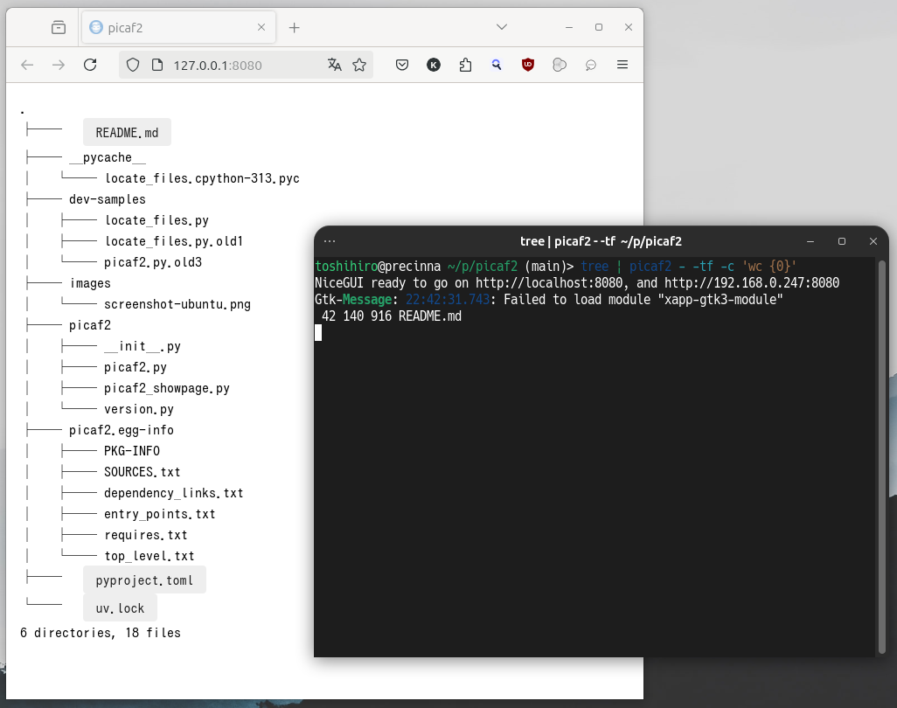

# picaf2

`picaf2` (Pick-up a file) is a tool to generate a clickable map of files.

Show the window that allows you to click filenames, from text containing file names.

## Installation

```sh
pipx install git+https://github.com/tos-kamiya/picaf2
```

## Usage

```sh
picaf2 [options] inupt_file
```

Launch a web page showing text in the file as a map of clickable filenames.

By default, when a file name is clicked, print the filename. With the option `-c`, you can execute the specified command for the filename.

### Options

```
-c COMMAND, --command=COMMAND     Command line for the clicked file. `{0}` is a place holder to put a file name.
```

### Example of Use/Screenshots

**Ubuntu 24.04**

```sh
tree | picaf2 -
```



## Changelog

* v0.1.0 the first release.
